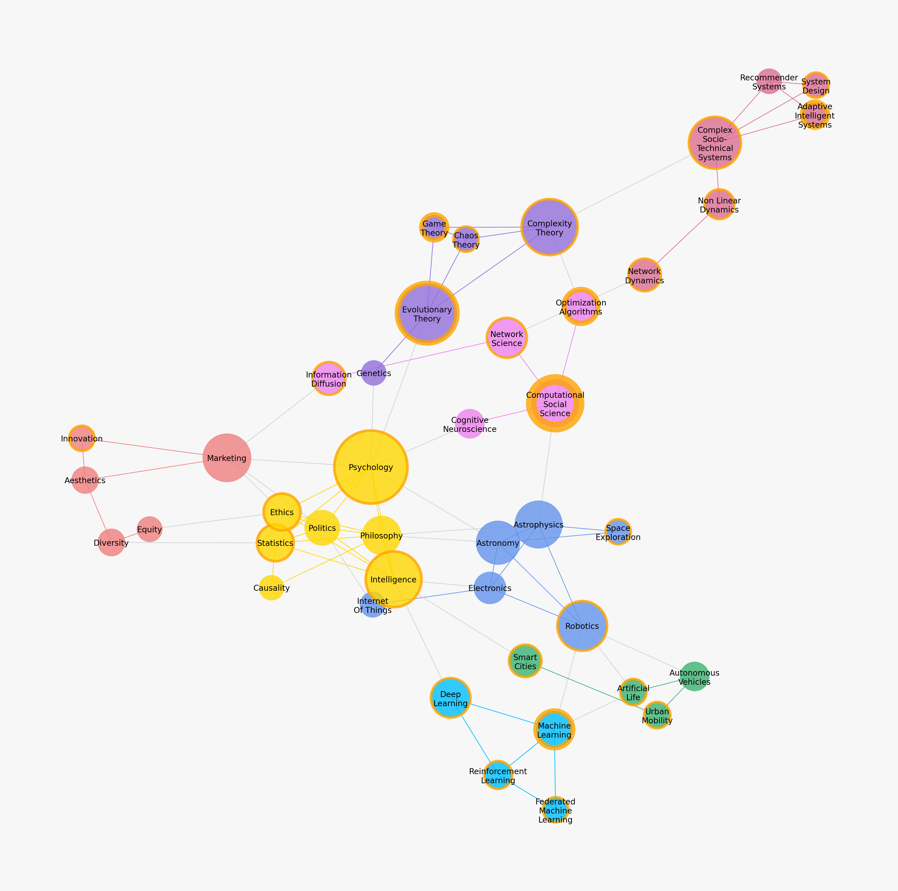

# Lejin Varghese

I have 13 years of experience developing data products and solutions in the retail, ecommerce, information retrieval, automotive and marketing domains across the spectrum of `artificial intelligence`, `deep learning`, `machine learning`, `statistical inference`, `causal inference`, `data engineering`, `business intelligence`, and `hybrid cloud platform integrations`.

I have specifically developed an expertise in creating personalized experiences on digital platforms for industry leading Forbes 50 brands across several industries.

I am a continuous learner, a data hog, a scientist, an engineer, a philosopher, an artist and an aspiring polymath who's most lately passionate about adaptive intelligent systems, reinforcement learning, graph neural networks, autonomous vehicles, optimization algorithms, information retrieval, and complexity theory. I value integrity, innovation and humancentric progress.

## Interests

:construction:

code that generated this can be found [here](https://github.com/lejinvarghese/ego_networks/tree/master/labs/domain_graph).

## Reading

:books: [Goodreads](https://www.goodreads.com/lejin)

## Learning

:microscope: [Coursera](https://www.coursera.org/user/bc2928e2dc2ded5b43add4898ff94993)\
:microscope: [Udemy](https://www.udemy.com/user/lejin-rajan/)
